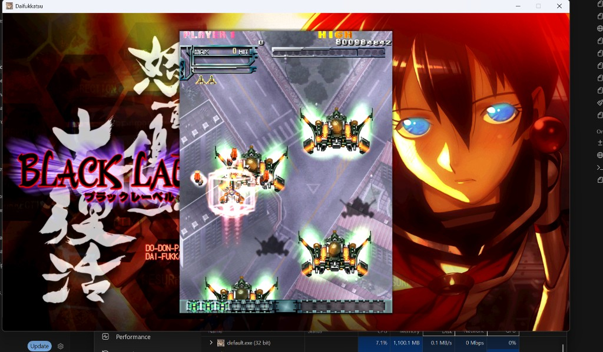

# dodonpachi-savestates

Save states for **DoDonPachi Resurrection** on PC, via a drop-in replacement for
`d3d9.dll` that renders the entire game on the CPU.

One slot, saved and restored instantly from the keyboard, so you can drill a
boss pattern from the exact moment before it kills you instead of replaying the
stage. There is no emulator involved — the retail Steam build runs normally, and
the wrapper sits between it and Direct3D.



## Controls

| Key | Action |
| --- | --- |
| `F5` | Save state |
| `Shift` + `F5` | Restore it |
| `F9` | Lossless screen capture, for reporting rendering bugs |

There is currently **one** slot. The hotkey handler is written for `F5`
onwards and will light up `F6`–`F8` the moment `SAVESTATE_SLOTS` in
`src/savestate.h` is raised, but a snapshot holds a copy of the game's writable
memory and the game is not small, so extra slots cost real RAM. It is set to
one until somebody has measured what four actually costs.

## Install

1. Grab `d3d9.dll` from [Releases](../../releases), or build it yourself (below).
2. Drop it next to `default.exe`, in
   `steamapps/common/DoDonPachi Resurrection/`.
3. Launch the game as usual.

To uninstall, delete the file. Nothing else on your system is touched — no
installer, no registry keys, no changes outside the game folder.

### If the game does not start

The game is from 2016 and needs Visual C++ 2010 runtimes (`MSVCR100.dll` and
friends), which it normally ships in its own folder. If those go missing the
game will not start, with or without this wrapper.

Fix it in Steam first: **right-click the game → Properties → Installed Files →
Verify integrity of game files.** That restores the game's own copies. Failing
that, install the **Microsoft Visual C++ 2010 Redistributable (x86)** from
Microsoft.

This project deliberately does not bundle those DLLs. They are Microsoft's
copy written files, not mine, and you should get them from Microsoft or from Steam rather
than from a stranger on the internet.

## What it actually is

A reimplementation of the Direct3D 9 interfaces the game uses, backed by a
software rasteriser. Every triangle, every texture fetch and every blend is done
on the CPU, and the finished frame is handed to the OS as a plain bitmap. Your
GPU does nothing.

That sounds like a strange way to get save states, and it is. Save states need a
consistent snapshot of the process, and anything living in driver-owned GPU
memory cannot be captured or rewound. Once rendering is entirely in ordinary
process memory, a snapshot becomes possible: the engine walks the heap and the
threads, records them, and can put them back.

Performance is therefore CPU-bound. A modern multi-core machine runs it fine;
the rasteriser is multithreaded and uses SSE2/AVX2 where available.

## Known limitations

- **Restores can fail rather than restore.** The engine refuses to load a state
  it cannot prove is safe, so it fails closed instead of resuming into a corrupt
  process. In practice this means an occasional restore that does nothing.
- **Audio does not always follow a restore.** A track loaded at save time may
  not resume correctly. Gameplay is unaffected.
- **Not a speedrun tool.** Frame timing is not cycle-accurate and this is not a
  substitute for real hardware or a verified emulator.

## The one game bug this fixes

Independent of the renderer, the game has a crash of its own: in **training
mode, Black Label, stage 1-1, route B, starting at the boss**, restarting the
stage reliably crashes it. This reproduces on stock installations with none of
this software present.

The game stores render records in a fixed-capacity buffer, 68 bytes each, and a
training-mode stage restart leaks entries instead of clearing them. With enough
on screen the list outgrows the buffer and a `rep movsd` block copy runs off the
end, always at `default.exe+0x9B730`.

Growing the buffer turned out to be impossible. It sits inside a larger arena
with a 4 KB reserved tail, and the free space after it was misaligned and about
12 KB, while Windows reserves memory on a 64 KB granularity. There was nowhere
to grow into.

So the copy is stopped at the boundary instead, which is what the missing bounds
check would have done. A vectored exception handler catches the fault and drives
the loop out through its own normal exit path — clearing `ECX` makes the
faulting instruction copy nothing, setting `ZF` sends the `jne` behind it out of
the loop, and the frame's byte count is corrected so nothing downstream reads
records that were never written. Records that did not fit are dropped, so a
frame over capacity draws slightly short. That is a visible symptom rather than
a hidden one, which beats a hard crash.

It only fires on an exact match against the faulting address, so it applies to
this build of this executable and nothing else. Set `D3D9SW_OVERRUN=0` to
disable it.

## Building

**You do not need to build this.** The [release](../../releases) has the DLL
ready to drop in. Build it only if you would rather not run a binary you did not
compile — which is a perfectly reasonable thing to want.

Requires [zig 0.15.2](https://ziglang.org/download/), used only as a C compiler because
it cross-compiles to 32-bit Windows with no SDK install. There is nothing else
to install — no Visual Studio, no Windows SDK.

Built and tested with **zig 0.15.2** (clang 20.1.2). Other versions should be
fine: nothing here uses zig's build system or its language, only `zig cc`, which
is a clang driver, so the churn between zig releases mostly does not apply. The
one real floor is zig 0.11, which is when the target triple became
`x86-windows-gnu` rather than `i386-windows-gnu`. Any clang that can target
32-bit mingw-w64 works just as well if you would rather not install zig.

Then double-click **`build.cmd`**, or from a terminal:

```
build.cmd
```

`build\d3d9.dll` is the file to drop next to the game.

`build.cmd` exists because PowerShell refuses to run unsigned scripts that came
from the internet, and `build.ps1` will have. It scopes that exemption to this
one script rather than asking you to weaken a machine-wide setting. If you would
rather invoke the script directly, `powershell -ExecutionPolicy Bypass -File
build.ps1` does the same thing, and reading both files first is encouraged.

## Verifying it

`build\test_seam.exe` audits the rasteriser without needing any reference image.
It renders additively so each pixel counts how many triangles claimed it, and
blits from a texture whose every texel is distinct, so coverage gaps, doubled
pixels and wrong texels are each named rather than eyeballed.

It also carries **deliberate negative controls that must fail**. A clean run only
means something if the instrument can still detect a fault, so the suite submits
a knowingly doubled surface and a knowingly misaligned blit and reports itself
broken if those come back clean.

`build\ss_harness.exe` drives the save state engine directly, with no game and
no wrapper, asserting invariants after every restore rather than waiting to see
whether something dies later.

## Diagnostics

Set these as environment variables before launching. Steam caches the
environment at startup, so restart Steam after changing one — the wrapper logs
the values it actually resolved to `d3d9_sw.log`, which is the quickest way to
tell whether a change took effect.

| Variable | Effect |
| --- | --- |
| `D3D9SW_HALFPIXEL=0` | Use D3D10 pixel centres instead of D3D9's. Off by default; this was the cause of a texture misalignment bug and the switch is kept for A/B testing. |
| `D3D9SW_FILTER=p` / `=l` | Force point or linear filtering instead of letting the game choose. |
| `D3D9SW_NOSIMD=1` | Scalar rasteriser only, no SSE2/AVX2. |
| `D3D9SW_THREADS=n` | Rasteriser worker threads. |
| `D3D9SW_OVERRUN=0` | Disable the crash fix described above. |
| `D3D9SW_PROF=1` | Per-frame timing to `d3d9_sw.log`. |

## On the use of AI

Large parts of this were written with AI assistance, and I would rather say so
plainly than have someone work it out.

What that did and did not mean in practice is worth being specific about, since
"AI wrote it" covers a wide range. The crash fix came from reading the faulting
function's disassembly and matching an exact instruction address. The renderer
bug that caused visible seams was found by building a test that fails on purpose
when the bug is present, then confirming it passes only once the bug is gone —
which is also how I know an earlier theory about the cause was wrong, because
the test refused to reproduce it and sent me looking somewhere else.

The code is here so you can check any of that rather than take my word for it.

## License

[MIT](LICENSE). Do what you like with it; keep the copyright notice.

This is an unofficial, unaffiliated fan project. DoDonPachi Resurrection is the
property of CAVE Interactive; no game code or assets are included here.
