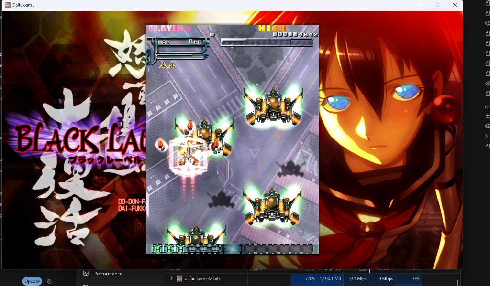

# dodonpachi-savestates

Save states for **DoDonPachi Resurrection** on PC, via a drop-in replacement for
`d3d9.dll` that renders the entire game on the CPU.

Four slots, saved and restored from the keyboard, so you can drill a
boss pattern from the exact moment before it kills you instead of replaying the
stage. There is no emulator involved — the retail Steam build runs normally, and
the wrapper sits between it and Direct3D.



## Where 2.0 stands

- **Save states work.** Saving and loading while the game is running is
  settled for this game: four slots, loaded as often as you like.
- **No GPU needed.** The whole game is drawn on the CPU, so it runs on a
  machine with no working Direct3D driver at all.
- **Saves survive a restart, but don't rely on that yet.** A slot is written to
  disk, and you can quit, relaunch and load it on the same machine. That works
  and is stable in testing, but it is not dependable: treat a slot from an
  earlier launch as a bonus, not a backup.
- **Saves do not move between machines yet.** A slot carries addresses inside
  Windows' own DLLs, and those change with every monthly Windows update. A slot
  from a machine on a different update loads its music and nothing else. The
  log says so before it tries (see [Logs](#logs)).
- **A slot only loads into the same build of the DLL that wrote it.** Updating
  the DLL retires your old slots.

## Controls

| Key | Action |
| --- | --- |
| `F5` - `F8` | Save to slot 1 - 4 |
| `Shift` + `F5` - `F8` | Load that slot |
| `Alt` + `Enter` | Toggle borderless fullscreen |
| `F9` | Lossless screen capture, for reporting rendering bugs |

Hotkeys only act while the game is the focused window, so they will not fire
while you are in another application.

Each slot is a file in the game folder (`d3d9sw_slot0.*` to `d3d9sw_slot3.*`)
holding the game's writable memory, roughly 250 - 850 MB depending on where
you are in the game. Budget a few GB of disk for all four.

## Install

1. Grab `d3d9.dll` and `d3d9_sw.cfg` from [Releases](../../releases), or
   build the DLL yourself (below); the cfg is in this repo.
2. Drop both next to `default.exe`, in
   `steamapps/common/DoDonPachi Resurrection/`.
3. Launch the game through Steam as usual.

The cfg matters: it places the game's memory at fixed addresses so a slot can
be loaded back. Without it the game still runs, but slots are far less likely
to load.

The wrapper writes into the game folder: the slot files, a texture cache
(`d3d9sw_pack`) and a `logs` folder. To uninstall, delete `d3d9.dll`,
`d3d9_sw.cfg` and those. Nothing else on your system is touched — no
installer, no registry keys, no changes outside the game folder.

### If the game does not start

The game is from 2016 and needs Visual C++ 2010 runtimes (`MSVCR100.dll` and
friends), which it normally ships in its own folder. If those go missing the
game will not start, with or without this wrapper.

Fix it in Steam first: **right-click the game → Properties → Installed Files →
Verify integrity of game files.** That restores the game's own copies and is
almost always the whole answer.

If you would rather install the runtimes properly, note that the files the game
wants come from **two different Microsoft packages**, which is easy to get
wrong:

| Missing file | Comes from |
| --- | --- |
| `MSVCR100.dll`, `MSVCP100.dll` | [Visual C++ 2010 SP1 Redistributable (x86)](https://www.microsoft.com/en-us/download/details.aspx?id=26999) |
| `d3dx9_43.dll`, `d3dcompiler_43.dll`, `XINPUT1_3.dll` | [DirectX End-User Runtime (June 2010)](https://www.microsoft.com/en-us/download/details.aspx?id=8109) |

Installing only the Visual C++ package leaves the DirectX files missing, and the
game fails the same way, which makes it look like the first fix did nothing.

This project deliberately does not bundle those DLLs. They are Microsoft's
copyrighted files, not mine, and you should get them from Microsoft or from
Steam rather than from a stranger on the internet.

## What it actually is

A reimplementation of the Direct3D 9 interfaces the game uses, backed by a
software rasteriser. Every triangle, every texture fetch and every blend is done
on the CPU, and the finished frame is handed to the OS as a plain bitmap. Your
GPU does nothing.

That sounds like a strange way to get save states, and it is. Save states need a
consistent snapshot of the process, and anything living in driver-owned GPU
memory cannot be captured or rewound. Once rendering is entirely in ordinary
process memory, a snapshot becomes possible: the engine walks the heap and the
threads, records them, and can put them back.

Performance is therefore CPU-bound. A modern multi-core machine runs it fine;
the rasteriser is multithreaded and uses SSE2/AVX2 where available.

## Known limitations

- **Loading a slot from an earlier launch can hang or crash.** It works on the
  same machine in testing, but it is a much harder restore than one within a
  launch and is not yet dependable. See [Where 2.0 stands](#where-20-stands).
- **Slots do not load on another machine** unless it is on exactly the same
  Windows update. Loading one from a different update plays the music and
  draws nothing.
- **A new DLL build cannot load old slots.** The log says "build differs".
- **Changing the window size stalls the game briefly.** Resizing, maximizing or
  toggling fullscreen makes the game rebuild its device resources, one of which
  is a 4096x4096 texture, and that is not quick to reconvert on a CPU. The game
  is held still while it happens rather than being allowed to run on half-built
  state, so it is a pause rather than a glitch, but it is noticeable. Reducing
  it is a job for a later version.
- **Maximizing the window is not finished.** `D3D9SW_RESIZABLE=1` adds the
  maximize button and a drag-resizable frame, and the scaling side works, but
  maximize is one-way: the restore button greys out afterwards. Making it behave
  needs the wrapper to own the window's messages, which is a bigger commitment
  than the feature is worth so far. Off by default. Use Alt+Enter instead.
- **Some graphical artifacts remain.** A small number of shared triangle edges
  leak a pixel or two, which `test_seam.exe` reports as a known issue rather
  than hiding. Nothing that affects play, but it is there and it is tracked.
- **Exclusive fullscreen is still not implemented,** and will not be. Fullscreen
  here is borderless: the window is stretched over the monitor with no display
  mode switch, which is what you want anyway on a modern desktop. It means no
  mode-change flicker, working alt-tab, and no chance of leaving the display in
  a bad state if the game dies. Alt+Enter toggles it.
- **The frame rate paces the game, not just the display.** On a CPU that cannot
  hold 60, the game runs slower rather than dropping frames.
- **Not a speedrun tool.** Frame timing is not cycle-accurate and this is not a
  substitute for real hardware or a verified emulator.
- **Tested on a small number of machines.** It has been stable on every system
  it has run on, but that is a handful of Windows 10 and 11 desktops and a
  laptop, all with the same handful of GPUs. Treat "stable" as unproven
  elsewhere rather than guaranteed, and open an issue if your machine disagrees.

## Display and scaling

The game renders at the size it was configured for and the finished frame is
scaled to the window, using nearest-neighbour so the art stays sharp rather than
being smeared by a filter.

The wrapper declares itself DPI-aware, which matters more than it sounds. On a
display scaled above 100% a process that does not say this is handed fake
coordinates and Windows quietly stretches its output up to the real panel with a
blur nobody asked for — so the picture would be resampled twice, once by us and
once by the compositor. Declaring awareness leaves exactly one scale, ours.

That scale is lossless whenever the panel is a whole multiple of the render size:
720p into a 1440p panel is exactly 2x, and nearest-neighbour at 2x invents
nothing. At other ratios some pixel rows are duplicated and others are not, which
is visible on text as slightly uneven strokes. `D3D9SW_SCALE=integer` trades that
away, scaling by the largest whole multiple that fits and putting black bars
around the rest. There is no third option that is both sharp and gap-free; the
arithmetic does not allow one.

Since the render size is fixed and only the final scale changes, the size of the
window costs nothing to draw.

## The one game bug this fixes

Independent of the renderer, the game has a crash of its own: in **training
mode, Black Label, stage 1-1, route B, starting at the boss**, restarting the
stage reliably crashes it. This reproduces on stock installations with none of
this software present.

The game stores render records in a fixed-capacity buffer, 68 bytes each, and a
training-mode stage restart leaks entries instead of clearing them. With enough
on screen the list outgrows the buffer and a `rep movsd` block copy runs off the
end, always at `default.exe+0x9B730`.

Growing the buffer turned out to be impossible. It sits inside a larger arena
with a 4 KB reserved tail, and the free space after it was misaligned and about
12 KB, while Windows reserves memory on a 64 KB granularity. There was nowhere
to grow into.

So the copy is stopped at the boundary instead, which is what the missing bounds
check would have done. A vectored exception handler catches the fault and drives
the loop out through its own normal exit path — clearing `ECX` makes the
faulting instruction copy nothing, setting `ZF` sends the `jne` behind it out of
the loop, and the frame's byte count is corrected so nothing downstream reads
records that were never written. Records that did not fit are dropped, so a
frame over capacity draws slightly short. That is a visible symptom rather than
a hidden one, which beats a hard crash.

It only fires on an exact match against the faulting address, so it applies to
this build of this executable and nothing else. Set `D3D9SW_OVERRUN=0` to
disable it.

## Building

**You do not need to build this.** The [release](../../releases) has the DLL
ready to drop in. Build it only if you would rather not run a binary you did not
compile — which is a perfectly reasonable thing to want.

Requires [zig 0.15.2](https://ziglang.org/download/), used only as a C compiler because
it cross-compiles to 32-bit Windows with no SDK install. There is nothing else
to install — no Visual Studio, no Windows SDK.

Built and tested with **zig 0.15.2** (clang 20.1.2). Other versions should be
fine: nothing here uses zig's build system or its language, only `zig cc`, which
is a clang driver, so the churn between zig releases mostly does not apply. The
one real floor is zig 0.11, which is when the target triple became
`x86-windows-gnu` rather than `i386-windows-gnu`. Any clang that can target
32-bit mingw-w64 works just as well if you would rather not install zig.

Then double-click **`build.cmd`**, or from a terminal:

```
build.cmd
```

`build\d3d9.dll` is the file to drop next to the game.

`build.cmd` exists because PowerShell refuses to run unsigned scripts that came
from the internet, and `build.ps1` will have. It scopes that exemption to this
one script rather than asking you to weaken a machine-wide setting. If you would
rather invoke the script directly, `powershell -ExecutionPolicy Bypass -File
build.ps1` does the same thing, and reading both files first is encouraged.

## Verifying it

`build\test_seam.exe` audits the rasteriser without needing any reference image.
It renders additively so each pixel counts how many triangles claimed it, and
blits from a texture whose every texel is distinct, so coverage gaps, doubled
pixels and wrong texels are each named rather than eyeballed.

It also carries **deliberate negative controls that must fail**. A clean run only
means something if the instrument can still detect a fault, so the suite submits
a knowingly doubled surface and a knowingly misaligned blit and reports itself
broken if those come back clean.

`build\ss_harness.exe` drives the save state engine directly, with no game and
no wrapper, asserting invariants after every restore rather than waiting to see
whether something dies later. **In 2.0 it has fallen behind the engine and
fails** (`ss_harness 200 4 synth` crashes, `heap` mode reports a lost heap). The
2.0 save states were verified in the game itself instead: saves and repeated
loads within a launch, and a save in one launch loaded in the next.

## Logs

Every launch gets its own folder, `logs\<date>_<time>_default_<pid>\`, inside
the game folder. Each log in it starts with the same header: the launch time,
the game and wrapper builds, the Windows build and the machine name. When
reporting a problem, zip that one folder.

`savestate.txt` is the one to read after a load. For a slot made in another
launch, it lists what the slot assumes and whether this launch matches:

```
expect: ntdll.dll build    saved stamp A3FDEA31 size 1BF000, here stamp 4945C4B4 size 1BF000 - NOT HANDLED
expect: main stack top     saved 00540000, here 00F00000 - handled
expect: 10 fact(s) the same, 2 different and handled, 0 different and NOT handled
```

Any "NOT HANDLED" line means the load is expected to fail.

## Diagnostics

Set these in `d3d9_sw.cfg` (one `NAME=value` per line) or as environment
variables, which win. Steam caches the environment at startup, so restart Steam
after changing a variable — `savestate.txt` logs the value each setting actually
resolved to, which is the quickest way to tell whether a change took effect.

| Variable | Effect |
| --- | --- |
| `D3D9SW_HALFPIXEL=0` | Use D3D10 pixel centres instead of D3D9's. Off by default; this was the cause of a texture misalignment bug and the switch is kept for A/B testing. |
| `D3D9SW_FILTER=p` / `=l` | Force point or linear filtering instead of letting the game choose. |
| `D3D9SW_NOSIMD=1` | Scalar rasteriser only, no SSE2/AVX2. |
| `D3D9SW_THREADS=n` | Rasteriser worker threads. |
| `D3D9SW_OVERRUN=0` | Disable the crash fix described above. |
| `D3D9SW_PROF=1` | Per-frame timing to `d3d9_sw.log`. |
| `D3D9SW_SCALE=integer` | Scale by whole multiples only, with black bars, instead of filling the window. |
| `D3D9SW_DPI=0` | Do not claim DPI awareness, and let Windows scale the output instead. |
| `D3D9SW_ALTENTER=0` | Disable the Alt+Enter fullscreen toggle. |
| `D3D9SW_RESIZABLE=1` | Add maximize and drag-to-resize to the game's fixed-size window. Incomplete: maximize sticks, see below. |

## On the use of AI

Large parts of this were written with AI assistance, and I would rather say so
plainly than have someone work it out.

What that did and did not mean in practice is worth being specific about, since
"AI wrote it" covers a wide range. The crash fix came from reading the faulting
function's disassembly and matching an exact instruction address. The renderer
bug that caused visible seams was found by building a test that fails on purpose
when the bug is present, then confirming it passes only once the bug is gone —
which is also how I know an earlier theory about the cause was wrong, because
the test refused to reproduce it and sent me looking somewhere else.

The code is here so you can check any of that rather than take my word for it.

## License

[MIT](LICENSE). Do what you like with it; keep the copyright notice.

This is an unofficial, unaffiliated fan project. DoDonPachi Resurrection is the
property of CAVE Interactive; no game code or assets are included here.
